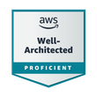
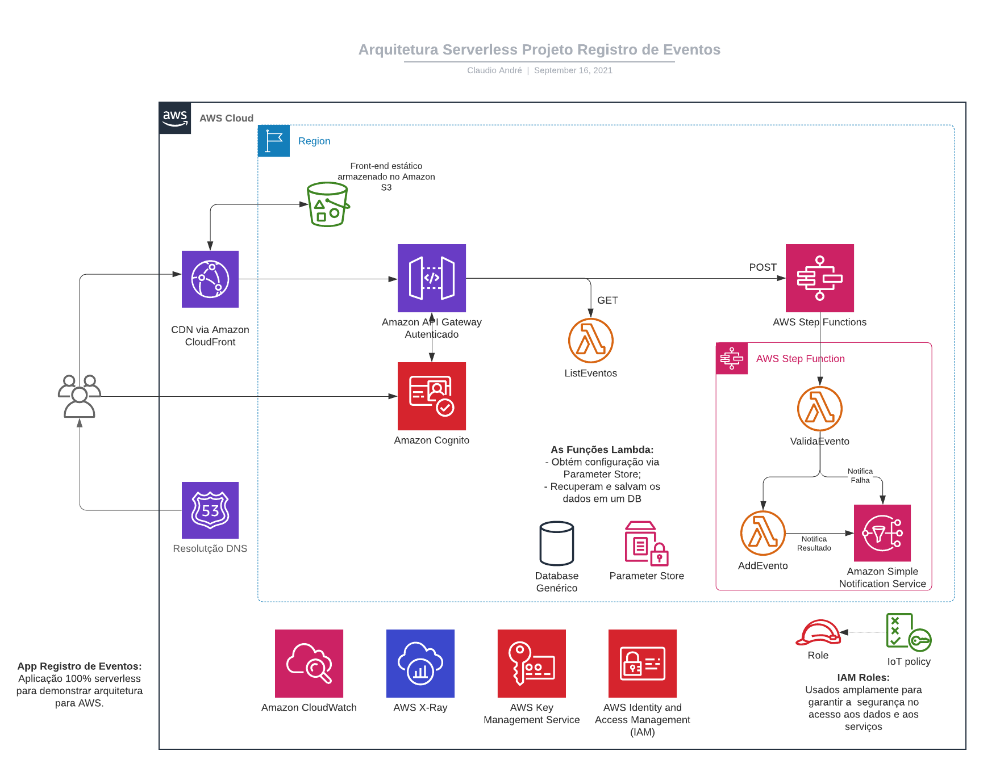

# Exemplos e Boas Práticas em Cloud

Este repositório serve como um portfólio de soluções Cloud que eu desevolvi ou adaptei. Ainda, para demonstrar minha vivência na plataforma AWS. Por fim, como um _cheat sheet_ usado para referência e consultas rápidas.

Foi criado para armazenar projetos-exemplo que sirvam para discutir, avaliar, estudar ou demonstrar boas práticas em Cloud. Todo material se baseia em fontes reconhecidas (por exemplo, os materiais oferecidos pela própria AWS).

 | | | | GitHub Arctic Code Vault Contributor |
 :----------:|:----------:|:----------:|:----------:
 |  |  |  |  |
 |  |    AZ-900 |    DP-900 | |
 |  |  |  |  |
 |  |  |  |  |
 |  |  |  | 

# Índice
1. [Portfolio de Cloud (Aplicações de Demonstração e Exemplo)](#aplicações)
    1. [Aplicação "Diretório de Funcionários"](#demo-i-diretório-de-funcionários)
    1. [Aplicação "Clima no Campus"](#demo-ii-clima-no-campus)
    1. [Aplicação "Registro de Eventos"](#demo-iii-registro-de-eventos)
1. [AWS Identity and Access Management](#aws-identity-and-access-management-aws-iam)
6. [Cursos AWS que são um show](#cursos-recomendados)
7. [Segurança](#security)
8. [Licença](#license)

# Aplicações

Portfólio Cloud criado para armazenar projetos-exemplo que sirvam para discutir, avaliar, estudar ou demonstrar boas práticas em Cloud.

### Demo I "Diretório de Funcionários"

Aplicação desenvolvida pela AWS Training. Clique no link para visualizar como eu [implementei a solução](diretorio-pessoas#diretório-de-funcionários).

#### Pontos a Destacar na Implementação
- Infraestrutura como código (IaC) foi usado;
- O projeto implementa alta disponibilidade via Application Load Balancer (ALB) em múltiplas AZs;
- O projeto prevê segurança 'by design';
  - Os servidores Web **NÃO** possuem IP público, todo acesso se dá via ALB (desabilitado: requer NAT, que tem custo);
  - Os servidores Web aceitam conexões **APENAS** do ALB;
- A aplicação acessa arquivos no S3, mas o S3 **NÃO** está com acesso público;
- Logs de acesso à aplicação Web (obtidos do ALB) são salvos no S3 para auditoria.

Application Load Balancer (ALB) é um dos tipos de Elastic Load Balancer (ELB).

### Demo II "Clima no Campus"

Aplicação adaptada de um app desenvolvido pela AWS Training. Clique no link para visualizar como eu [implementei a solução](serverless#serverless).

#### Pontos a Destacar na Implementação
- Aplicação 100% serverless;
- Implementa uma interface de conversação capaz de lidar com voz e texto;
- O bot para interação é capaz de reconhecimento de fala e compreensão de linguagem natural;
- Uso de CDN para melhorar a experiência no usuário;
- O S3 **NÃO** está com acesso público (apenas o CloudFront pode acessar a origem).

### Demo III "Registro de Eventos"

Aplicação adaptada de um app desenvolvido pela AWS Training. Clique no link para visualizar como eu [implementei a solução](registroEventos#causos-da-roça).

#### Pontos a Destacar na Implementação
- Aplicação 100% serverless;
- Autenticação via Cognito (possui controle de acesso "serverless");
- Utiliza processamento assíncrono (usuário posta uma requisição de forma assíncrona e recebe resposta ao fim do processamento);
- Uso de CDN para melhorar a experiência no usuário.

## AWS Identity and Access Management (AWS IAM)

Neste tópico, eu salvei coisas interessantes relacionadas ao controle de acesso. Salvei alguns exemplos de policy (que eu criei no papel, sem testar) que são bons indicadores das possibilidades que o IAM oferece.

Clique no link para visualizar [os exemplos que criei](IAM#policies).

O fluxograma abaixo demonstra de forma simplificada [1] como a avaliação sobre conceder ou não direitos a um usuário funciona. Contudo, muitos outros fatores influenciam esta decisão, como você poder ver no [fluxograma desta página](https://docs.aws.amazon.com/IAM/latest/UserGuide/reference_policies_evaluation-logic.html#policy-eval-denyallow).

Para criar policies, beba da fonte mais pura. Use estes exemplos:
- https://docs.aws.amazon.com/IAM/latest/UserGuide/access_policies_examples.html

Ou use uma GUI para te auxiliar a iniciar a jornada:
- https://awspolicygen.s3.amazonaws.com/policygen.html

[1] Dizer que não se pode restringir o acesso do root user é uma simplificação.
    O root user é o proprietário da conta e pode administrá-la, mas, via
    SCP o root pode ser limitado dentro da organização e, via policies, você
    também consegue proteger recursos de "erros" de um usuário root.
    Veja um exemplo no commit [c986b723c6dfc87572af578b2ded2309f75f49d9](https://github.com/claudioandre-br/cloud-portfolio/commit/c986b723c6dfc87572af578b2ded2309f75f49d9).

## Cursos Recomendados

Este tópico lista _alguns_[1] cursos AWS que eu fiz. São cursos oficiais, desenvolvidos e produzidos pela própria AWS; em alguns casos, operacionalizados por instituições credenciadas (`instituições reconhecidas de ensino superior`), mas todo o material audiovisual é de autoria da AWS.

- _AWS Training and Certification_
  * AWS Cloud Practitioner Essentials (**ES·PE·TA·CU·LAR**)
  * Getting Started with Cloud Acquisition
  * AWS Security Fundamentals (Second Edition)

- _Coursera_ fornecidos por Amazon Web Services
  * Introduction to AWS Identity and Access Management
  * AWS Fundamentals: Going Cloud-Native

  Via "AWS Fundamentals Specialization":
  * AWS Cloud Technical Essentials [2]
  * AWS Fundamentals: Addressing Security Risk [3]
  * AWS Fundamentals: Migrating to the Cloud
  * AWS Fundamentals: Building Serverless Applications [2]

- _Instituto Federal de São Paulo (IFSP)_
  * AWS Academy Cloud Foundations (ACF) [4]

- _AWS Educate_ (são cursos fracos, ainda assim, oficiais)
  * Solutions Architect

A AWS oferece muito material gratuito para treinamento:
- Get AWS Certified Global Challenges (ao menos Cloud Practitioner e Cloud Architect)
- AWS Training and Certification https://www.aws.training/ (muitos cursos são gratuitos)
- Qwiklabs https://amazon.qwiklabs.com/ (vários tutoriais são _free_)

Fiz minha revisão para a prova de arquiteto usando o curso Udemy do Stephane Maarek (recomendo). Custo baixo em um curso muito bom.

[1] Para manter a brevidade, alguns cursos não foram listados. Gostei bastante dos cursos oficiais, alguns estão disponíveis em alguma plataforma (por exemplo, curso desenvolvido pela AWS e disponível no Coursera). Valem muito a pena: profundidade e a precisão na medida certa.

[2] Curso muito interessante.

[3] Este é um curso que deixa a desejar, mas faz parte da especialização "AWS Fundamentals".

[4] Curso em português, com professor e gratuito.

## Security

Please inspect all packages prior to running any of them to ensure safety.
We already know they're safe, but you should verify the security and contents of any
binary from the internet you are not familiar with.

We take security very seriously.

## License

GNU General Public License v2.0