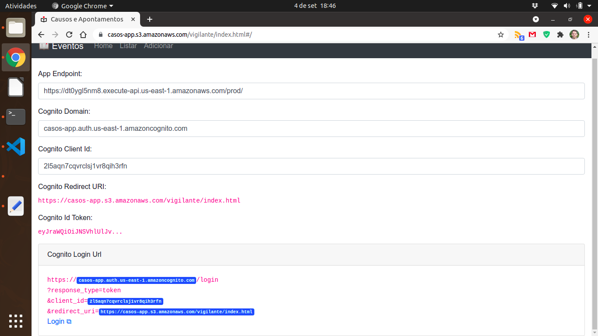
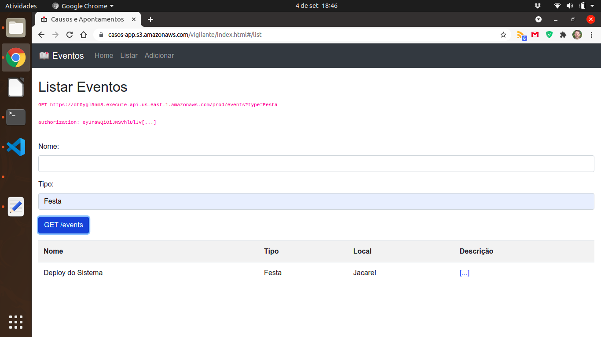
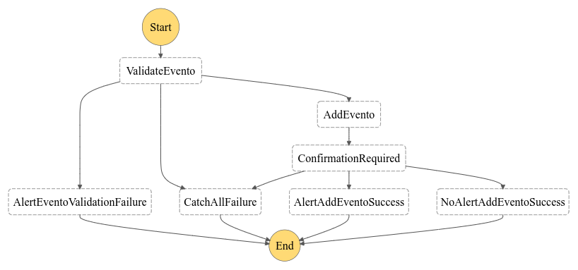

# Causos da Roça

Este diretório contém um aplicativo serverless que demonstra o uso do Cognito e de como acrescentar recursos dinâmicos a um site estático.

### Aplicação Demo "Registro de Eventos"

Eu fiz um site estático que, via API Gateway, registra os eventos de interesse de seus usuários.
- O objetivo do site é registrar "avistamentos", ocorrências, eventos ou casos. Fatos que forem vistos e que precisem ser registrados;
- O site foi concebido para ser um livro ou registro de eventos;
- Os dados digitados pelo usuário serão salvos em um banco de dados.

Esta aplicação utiliza os serviços serverless Amazon Cognito, o Amazon CloudFront, o Amazon API Gateway, AWS Lambda, AWS Step Functions e o Amazon S3. A aplicação contém:

- Uma interface web (site estático);
- Baixa latência via CDN (API Gateway via Endpoint Type);
- Persistência de dados;

### Como Tudo Funciona

Acesse o app via:
- https://casos-app.s3.amazonaws.com/vigilante/index.html

Configure a aplicação com estes dados (para facilitar a experimentação, o Front End é de
testes e desenvolvimento, a configuração fica salva em um cookie).

- Endpoint:
  - https://API_GW_ID.execute-api.us-east-1.amazonaws.com/prod/
- Cognito Domain:
  - casos-app.auth.us-east-1.amazoncognito.com
- Cognito Client Id:
  - 2l5aqn7cqvrclsj1vr8qih3rfn

Preencha os campos e clique em Login na parte inferior da tela:

O funcionamento da aplicação é intuitivo:

Funcionamento
- configure a aplicação conforme visto acima;
- vá até a parte inferior da tela e clique em Login;
- crie um usuário (use um email temporário como o Mailinator, se preferir);
- a autenticação ocorre via Cognito;
- Após o login o campo "Cognito Id Token" é preenchido:
- o frontend estático em HTML chama uma API REST definida no API Gateway;
- A API Gateway repassa a chamada para uma função lambda;
- a função lambda chamada salva ou recupera os dados em um banco de dados.

Observação:
- Os dados acima são de uma conta Vocareum;
- Como contas Vocareum não permitem Step Functions, a aplicação publicada funcionamento de forma síncrona;
- Eu testei o funcionamento assíncrono na minha própria conta.

A aplicação é:
- 100% serverless.
- o acesso é otimizado para a borda via CDN;
- esta otimização na borda me deu alguns problemas com o cache.

### A Máquina de Estados

O diagrama da máquina de estados usado para funcionamento assíncrono usado para salvar dados novos:

